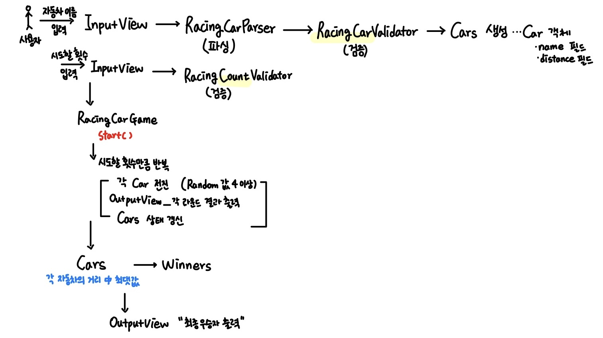

# 자동차 경주 🚗💨

경주할 자동차 이름과 시도할 횟수를 입력받아, 경주를 진행한 뒤 우승자를 계산해 최종 우승자를 출력한다.

---

이 시스템에서 핵심 기능💡은 "자동차들이 주어진 횟수만큼 전진 규칙에 따라 이동하고, 그 결과로 우승자를 결정하는 것"입니다.  
즉, 핵심은 아래 3가지 기능으로 구성됩니다.

### 1. 자동차의 전진 로직 (Car)

- 자동차 객체는 스스로 전진 조건을 판단하고 이동한다.
- `RandomNumberGenerator`로부터 생성된 0~9 사이의 숫자가 4 이상일 때 전진한다.

### 2. 자동차 집합의 관리 (Cars)

여러 자동차를 하나의 집합으로 관리하며, 각 자동차에게 전진 명령을 전달하고,     
경주가 끝난 뒤 **최대 이동 거리**를 계산하여 우승자를 판단한다.

- 모든 자동차 전진시키기 (`moveAll()`)
- 최대 거리 계산하기 (`findMaxDistance()`)
- 우승자 목록 생성 (`findWinners()`)

### 3. 우승자 계산 (Winners)

`Cars`로부터 전달받은 자동차 중 **최대 거리를 달성**한 자동차들을 우승자로 관리한다.  
여러 명의 우승자가 존재할 수 있으며, 우승자 이름을 쉼표(,)로 구분해 출력한다.

---

## 기능 명세서

### 1. 경주할 자동차 이름을 입력받는다. (이름은 쉼표(,) 기준으로 구분)

- [OutputView] "경주할 자동차 이름을 입력하세요.(이름은 쉼표(,) 기준으로 구분)" 문구를 출력한다.
- [InputView] 사용자의 입력을 문자열로 받는다.
- [RacingCarParser] 쉼표(,)를 기준으로 자동차 이름을 분리한다.
- [RacingCarValidator]
    - 자동차 대수가 최소 2대 이상인지 검증
    - 자동차 대수가 10대를 초과하지 않는지 검증
    - 자동차 이름이 문자열 형식인지 검증
    - 자동차 이름이 1자 이상 5자 이하인지 검증
    - 자동차 이름이 중복되어 입력되었는지 검증
- [Cars] 입력된 이름 목록으로 자동차 객체를 생성하고 보관한다.
- [Car] 자신의 이름을 저장하고, 현재 위치를 0으로 초기화한다.
    - 이름(name)과 위치(distance) 필드를 가진다.

**예외상황**

- 자동차 이름이 하나 이하인 경우 ➔ `[ERROR] 경주에 참여할 자동차는 최소 2대 이상이어야 합니다.`
- 자동차 수가 10대를 초과하는 경우 ➔ `[ERROR] 최대 10대까지만 출전 가능합니다.`
- 이름이 1자 이상 5자 이하가 아닌 경우 ➔ `[ERROR] 자동차 이름은 1자 이상 5자 이하만 가능합니다.`
- 이름이 한글 또는 영문만 입력하지 않은 경우 ➔ `[ERROR] 자동차 이름은 한글 또는 영문만 입력 가능합니다.`
- 자동차 이름이 중복되어 입력될 경우 ➔ `[ERROR] 자동차 이름이 중복되었습니다.`

### 2. 시도할 횟수를 입력 받는다.

- [OutputView] "시도할 횟수는 몇 회인가요?" 문구를 출력한다.
- [InputView] 사용자의 입력을 문자열로 받는다.
- [RacingCountValidator]
    - 입력이 숫자인지 검증
    - 입력값이 0인지 검증
    - 20회를 초과하지 않는지 검증
- [RacingCarGame] 입력된 횟수를 저장한다.

**예외상황**

- 입력값이 숫자가 아닌 경우 ➔ `[ERROR] 시도 횟수는 숫자여야 합니다.`
- 0을 입력한 경우 ➔ `[ERROR] 시도 횟수는 1회 이상이어야 합니다.`
- 20회를 초과한 경우 ➔ `[ERROR] 최대 20회까지만 시도할 수 있습니다.`

### 3. 경주를 진행한다.

- [RacingCarGame] 시도 횟수만큼 아래 과정을 반복한다.
- [Cars] 모든 자동차에게 전진 명령을 전달한다.
- [Car] 전진 여부를 판단한다.
    - [RandomNumberGenerator] 0에서 9 사이에서 무작위 값을 생성한다. (`Randoms.pickNumberInRange(0,9))`
    - 무작위 값이 4 이상일 경우 ➔ `move()`메서드로 전진 (`distance += 1`)
- [OutputView] 각 차수별 실행결과를 출력한다.
    - 자동차 이름과 거리(distance)를 "-"로 시각화하여 출력
    - 예시 : `pobi : --`

### 4. 우승자를 계산한다.

- [Cars] 각 자동차의 `distance` 중 최댓값을 계산한다.
- [Cars] 최댓값과 동일한 `distance`를 가진 자동차를 추출한다.
- [Winners] 우승자 목록을 저장한다. (여러명 가능)

### 5. 최종 우승자를 출력한다.

- [OutputView]
    - 단독 우승자일 경우 `최종 우승자 : pobi` 출력
    - 공동 우승자일 경우 `최종 우승자 : pobi, jun` 출력

### 🚨 예외 처리 정책 🚨

- 모든 입력 검증 실패 시 `IllegalArgumentException`을 발생
- 에러 메시지 출력 후 프로그램 종료
- `System.exit()` 호출 금지

---

### 기능 요구 사항에 기재되지 않은 내용에서 스스로 판단한 부분

- 경주할 자동차 이름은 한글과 영문만 허용한다.
    - `[ERROR] 자동차 이름은 한글 또는 영문만 입력 가능합니다.`
- 경주할 자동차 이름은 최대 10대까지 입력할 수 있다.
    - `[ERROR] 최대 10대까지만 출전 가능합니다.`
- 시도할 횟수는 최대 20회까지 입력할 수 있다.
    - `[ERROR] 최대 20회까지만 시도할 수 있습니다.`
